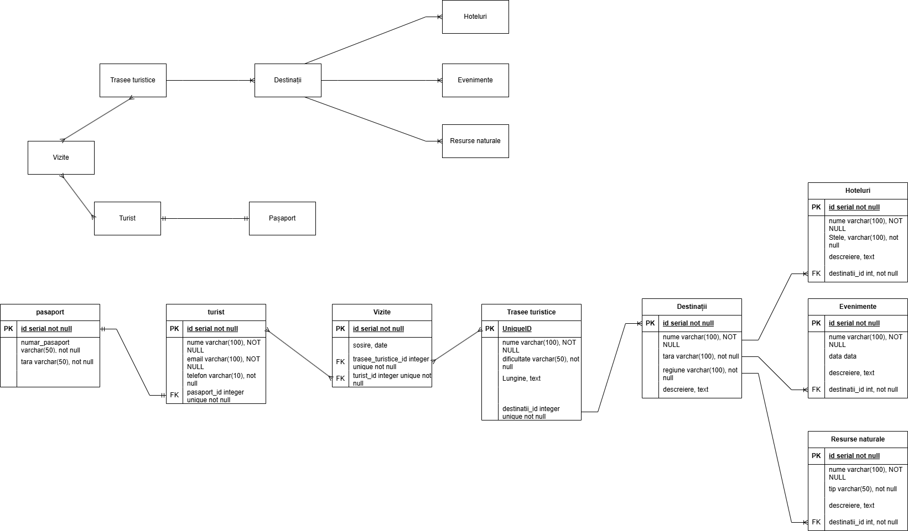

**ENUNT PROIECT** 

O firmă din domeniul turismului dorește să iși realizeze un sistem de gestionare a destinațiilor turistice necesar pentru a facilita ofertele turistice ale acesteia. Acest sistem trebuie să permită maparea destinațiilor existente și să ajute la dezvoltarea unor noi trasee turistice, plus valabilitatea infrastructuri hoteliere existente. De asemenea, se va implementa un sistem de urmărire a vizitatorilor, a traseelor turistice și a evenimentelor organizate în fiecare destinație.

Entități:
•	Turiști, Pașapoarte
•	Vizite
•	Trasee Turistice
•	Destinație
•	Resurse Naturale
•	Hoteluri 
•	Evenimente

