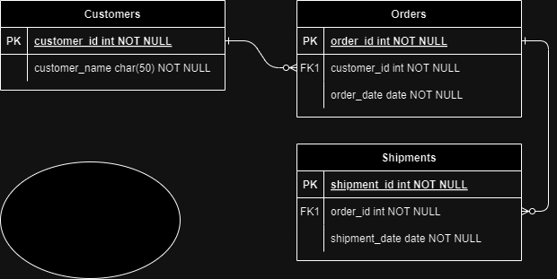

**ENUNT PROIECT** 

Exista o retea de supermarketuri care doreste sa isi mapeze locatiile si ulterior sa se extinda in zone neacoperite conform planurilor de manegment. Odata cu maparea supermaketurilor existente se doreste si implementarea unui sistem de urmarire a vanzarilor, a stocurilor existente dar si a necesarului de aprovizionare si comunicare directa cu furnizorii.

Entitati:
1.	Tara, judet, UAT
2.	Market,tip_market
3.	Vanzari,client,date_client
4.	Stoc, produse
5.	Furnizori,date_furnizori

